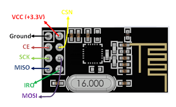

<p align="center" style=" width: 50%;height: 50%; object-fit: contain;"> 

</p>


# Install and Configure

## Requirement
1. `Raspberry Pi` or `beaglebone black` 
2. `Postgres`
3. `nRF24L01 `
4. `LCD1602`

## Database
install postgres and create `db` name  **smartdb**

edit .env.my_env file 
```
PG_USER = postgres
PG_PASS = *****
PG_DB = smartdb
PG_REMOTE = localhost
PG_PORT = 5432

```

### Server:

edit config.json 
```shell

    "first_init": false,
    "ServerHttpsPort": "443",
    "ServerHttpPort": "80",
    "WinServerHttpsPort": "6550",
    "WinServerHttpPort": "6551",
    "ServerIP": "127.0.0.1",
    "ServerSensorPort": 5050,
    "App_Name": "smart-pow",
    "Folder_Root": "/mypool"

```
note : ***set first_init =falst for init app*** 

## Create Self-signed certificate 
* https://getacert.com/selfsignedcert.html 
* copy Private key : a.pkey  and Public key(.cer) : a.cer to ssl folder

## Relay pin :
___
Pi - GPIO | Relay pin
--- | ---
17 | inp1
27 | inp2
22 | inp3
23 | inp4
4 (5v) | Relay VCC
20 (GND) | GND


***put Jumper on Relay Board ( JVCC  & VCC)***


##### LCD 1602 :

**PI - Pin 2 (5v) ------ VCC LCD**

## Run:
```
https://127.0.0.1:6550
```


## 
<p align="left" style=" width: 100%;height: 100%; object-fit: contain;"> 

</p>
<p align="center" style=" width: 50%;height: 50%; object-fit: contain;"> 

</p>

<p align="center" style=" width: 50%;height: 50%; object-fit: contain;"> 

</p>


